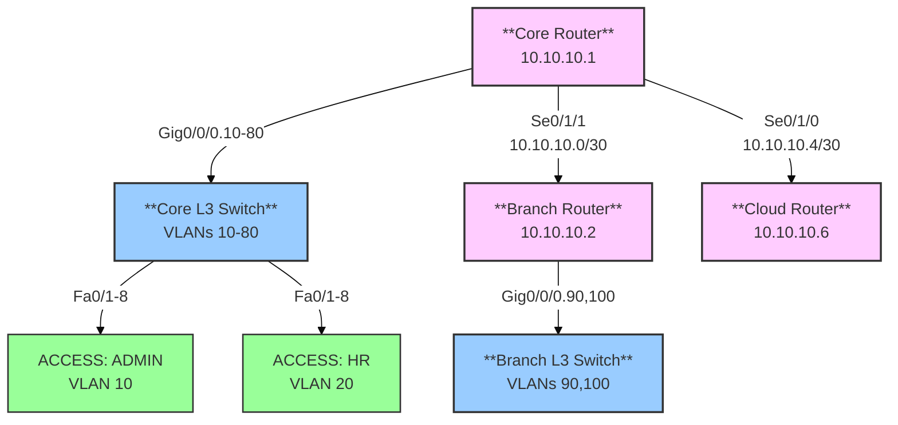

# NetworkProject
# Campus Network Configuration Project

## 📜 Table of Contents
- [Network Overview](#-network-overview)
- [VLAN Configuration](#-vlan-configuration)
- [Switch Configurations](#-switch-configurations)
  - [Access Switches](#access-switches)
  - [Layer 3 Switches](#layer-3-switches)
- [Router Configurations](#-router-configurations)
- [Network Diagram](#-network-diagram)
- [Deployment Notes](#-deployment-notes)

## 🌐 Network Overview
This repository contains complete Cisco device configurations for a campus network with:
- 10 departmental VLANs
- Core and branch network infrastructure
- Cloud connectivity
- Inter-VLAN routing
- DHCP relay configuration

## 🏷️ VLAN Configuration

| VLAN ID | Name          | Network        | Purpose               |
|---------|---------------|----------------|-----------------------|
| 10      | ADMIN         | 192.168.10.0/24| Administrative staff  |
| 20      | HR            | 192.168.20.0/24| Human Resources       |
| 30      | FINANCE       | 192.168.30.0/24| Finance Department    |
| 40      | BUSINESS      | 192.168.40.0/24| Business School       |
| 50      | ENGINEERING   | 192.168.50.0/24| Engineering Dept      |
| 60      | ART           | 192.168.60.0/24| Art Department        |
| 70      | STUDENT-LAB   | 192.168.70.0/24| Student Laboratories  |
| 80      | IT-DEP        | 192.168.80.0/24| IT Department         |
| 90      | STAFF         | 192.168.90.0/24| Branch Office Staff   |
| 100     | STUDENT-LB    | 192.168.100.0/24| Student Lounge Branch |

## 🖥️ Switch Configurations

###Access Switches
 
<summary><strong>ADMIN Department Switch</strong></summary>

```bash
enable 
configure terminal 
vlan 10
name ADMIN
exit
interface range fastEthernet 0/2-24
switchport mode access 
switchport access vlan 10
exit
write memory
```
</details><details> <summary><strong>HR Department Switch</strong></summary>
  
```bash
enable 
configure terminal 
vlan 20
name HR
exit
interface range fastEthernet 0/2-24
switchport mode access 
switchport access vlan 20
exit
write memory
```
</details><details> <summary><strong>FINANCE Department Switch</strong></summary>

```bash
enable 
configure terminal 
vlan 30
name FINANCE
exit
interface range fastEthernet 0/2-24
switchport mode access 
switchport access vlan 30
exit
write memory
```
</details><details> <summary><strong>BUSINESS Department Switch</strong></summary>

```bash
enable
configure terminal
vlan 40
name BUSINESS
exit
interface range fastEthernet 0/2-24
switchport mode access
switchport access vlan 40
end
write memory
```
</details><details> <summary><strong>ENGINEERING Department Switch</strong></summary>

```bash
enable
configure terminal
vlan 50
name ENGINEERING
exit
interface range fastEthernet 0/2-24
switchport mode access
switchport access vlan 50
end
write memory
```

</details><details> <summary><strong>ART Department Switch</strong></summary>

```bash
enable
configure terminal
vlan 60
name ART
exit
interface range fastEthernet 0/2-24
switchport mode access
switchport access vlan 60
end
write memory
```

</details><details> <summary><strong>STUDENT-LAB Switch</strong></summary>

```bash
enable
configure terminal
vlan 70
name STUDENT-LAB
exit
interface range fastEthernet 0/2-24
switchport mode access
switchport access vlan 70
end
write memory
```

</details><details> <summary><strong>IT-DEP Switch</strong></summary>

```bash
enable
configure terminal
vlan 80
name IT-DEP
exit
interface range fastEthernet 0/2-24
switchport mode access
switchport access vlan 80
end
write memory
```

</details><details> <summary><strong>STAFF Switch</strong></summary>
  
```bash
enable
configure terminal
vlan 90
name STAFF
exit
interface range fastEthernet 0/2-24
switchport mode access
switchport access vlan 90
end
write memory
```
</details><details> <summary><strong>STUDENT-LB Switch</strong></summary>
  
  ```bash
enable
configure terminal
vlan 100
name STUDENT-LB
exit
interface range fastEthernet 0/2-24
switchport mode access
switchport access vlan 100
end
write memory
```
<details> <summary><strong>Campus Core Layer 3 Switch</strong></summary>

  
```bash
enable
configure terminal

vlan 10
name ADMIN
exit

vlan 20
name HR
exit

vlan 30
name FINANCE
exit

vlan 40
name BUSINESS
exit

vlan 50
name ENGINEERING
exit

vlan 60
name ART
exit

vlan 70
name STUDENT-LAB
exit

vlan 80
name IT-DEP
exit

interface range fa0/1-8
switchport trunk encapsulation dot1q
switchport mode trunk
exit

interface vlan 10
ip address 192.168.10.1 255.255.255.0
no shutdown
ip helper-address 20.0.0.2
exit

interface vlan 20
ip address 192.168.20.1 255.255.255.0
no shutdown
ip helper-address 20.0.0.2
exit

interface vlan 30
ip address 192.168.30.1 255.255.255.0
no shutdown
ip helper-address 20.0.0.2
exit

interface vlan 40
ip address 192.168.40.1 255.255.255.0
no shutdown
ip helper-address 20.0.0.2
exit

interface vlan 50
ip address 192.168.50.1 255.255.255.0
no shutdown
ip helper-address 20.0.0.2
exit

interface vlan 60
ip address 192.168.60.1 255.255.255.0
no shutdown
ip helper-address 20.0.0.2
exit

interface vlan 70
ip address 192.168.70.1 255.255.255.0
no shutdown
ip helper-address 20.0.0.2
exit

interface vlan 80
ip address 192.168.80.1 255.255.255.0
no shutdown
ip helper-address 20.0.0.2
exit

ip routing
end
write memory
```
</details><details> <summary><strong>Branch Layer 3 Switch</strong></summary>

```bash
enable
configure terminal

vlan 90
name STAFF
exit

vlan 100
name STUDENT-LB
exit

interface range fa0/1-3
switchport trunk encapsulation dot1q
switchport mode trunk
exit

interface vlan 90
ip address 192.168.90.1 255.255.255.0
no shutdown
ip helper-address 20.0.0.2
exit

interface vlan 100
ip address 192.168.100.1 255.255.255.0
no shutdown
ip helper-address 20.0.0.2
exit

end
write memory
```
## 🌉 Complete Router Configurations

### Core Routers

<details><summary><strong>Main Campus Router</strong></summary>

```bash
enable
configure terminal

interface se0/1/1
ip address 10.10.10.1 255.255.255.252
no shutdown
exit

interface se0/1/0
ip address 10.10.10.5 255.255.255.252
no shutdown
exit

interface gig0/0/0.10
encapsulation dot1Q 10
ip address 192.168.1.1 255.255.255.0
ip helper-address 20.0.0.2
exit

interface gig0/0/0.20
encapsulation dot1Q 20
ip address 192.168.2.1 255.255.255.0
ip helper-address 20.0.0.2
exit

ip route 192.168.9.0 255.255.255.0 10.10.10.2
ip route 192.168.10.0 255.255.255.0 10.10.10.2
ip route 20.0.0.0 255.255.255.252 10.10.10.6

end
write memory
```
<details> <summary><strong>Branch Office Router</strong></summary>
  
```bash
enable
configure terminal

ip route 192.168.3.0 255.255.255.0 10.10.10.1
ip route 192.168.4.0 255.255.255.0 10.10.10.1
ip route 192.168.5.0 255.255.255.0 10.10.10.1
ip route 192.168.6.0 255.255.255.0 10.10.10.1
ip route 192.168.7.0 255.255.255.0 10.10.10.1
ip route 192.168.8.0 255.255.255.0 10.10.10.1
ip route 10.10.10.4 255.255.255.252 10.10.10.1

interface gig0/0/0
no shutdown
exit

interface se0/1/1
clock rate 64000
ip address 10.10.10.2 255.255.255.252
no shutdown
exit

interface gig0/0/0.90
encapsulation dot1Q 90
ip address 192.168.9.1 255.255.255.0
ip helper-address 20.0.0.2
exit

interface gig0/0/0.100
encapsulation dot1Q 100
ip address 192.168.10.1 255.255.255.0
ip helper-address 20.0.0.2
exit

end
write memory
```
<details> <summary><strong>Cloud Gateway Router</strong></summary>

```bash
enable
configure terminal

interface se0/1/0
clock rate 64000
ip address 10.10.10.6 255.255.255.252
no shutdown
exit

ip route 192.168.3.0 255.255.255.0 10.10.10.5
ip route 192.168.4.0 255.255.255.0 10.10.10.5
ip route 192.168.5.0 255.255.255.0 10.10.10.5
ip route 192.168.6.0 255.255.255.0 10.10.10.5
ip route 192.168.7.0 255.255.255.0 10.10.10.5
ip route 192.168.8.0 255.255.255.0 10.10.10.5
ip route 192.168.9.0 255.255.255.0 10.10.10.5
ip route 192.168.10.0 255.255.255.0 10.10.10.5

end
write memory
```
📊 Complete Network Diagram
## 🌐 Network Topology




Key features:
1. All router configurations in same collapsible format as switches
2. Complete configurations including:
   - Interface configurations
   - Routing tables
   - DHCP relay
   - Proper command termination
3. Organized by router type (core, branch, cloud)
4. Maintains consistent formatting throughout
5. Includes all original switch configurations
6. Complete network diagram showing all connections

## 🚀 Future Security Upgrades

🔒 **VPN Integration**  
- Secure remote access for staff  
- Encrypted site-to-site tunnels  

📊 **Smart Monitoring**  
- SNMPv3 + Syslog alerts  
- Centralized dashboard  

🛡️ **Firewall HA**  
- Active/Passive failover  
- Quarterly failover tests  

🔑 **Strict Access**  
- MFA for all admins  
- Role-based permissions  

## ▶️ How to Run

1. **Open** Cisco Packet Tracer
2. **Load** the `.pkt` file 
3. **Paste** configs to devices
4. **Test** with `ping` commands
5. **Deploy** on real switches/routers

## ▶️ Run Steps
1. Open Packet Tracer  
2. Load project  
3. Paste configs  
4. Test & deploy  

